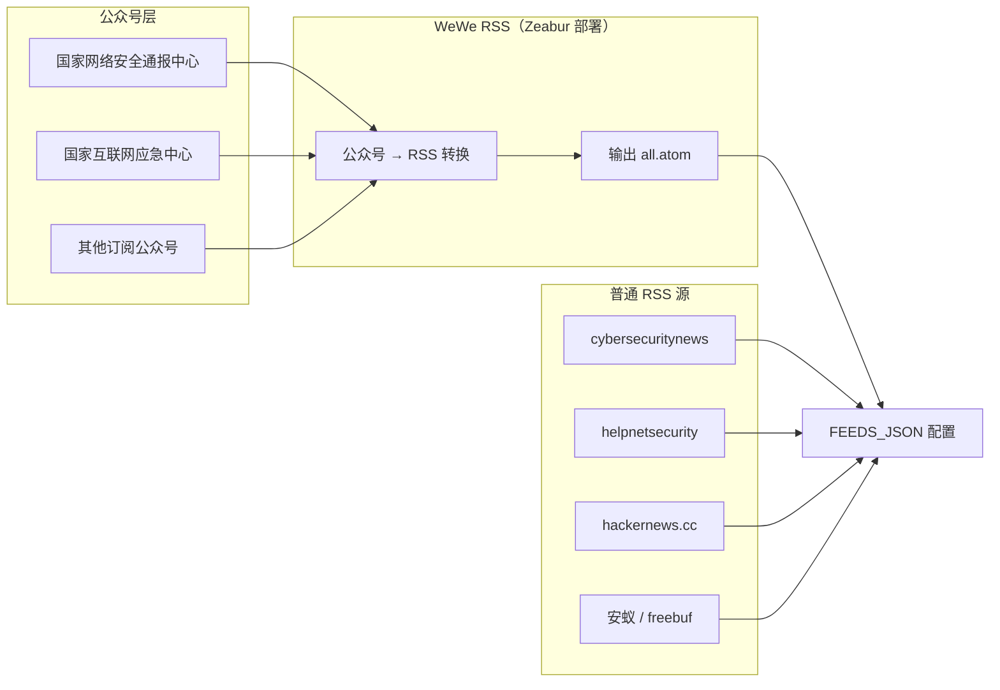
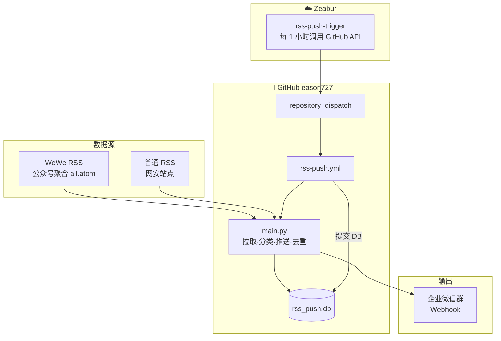
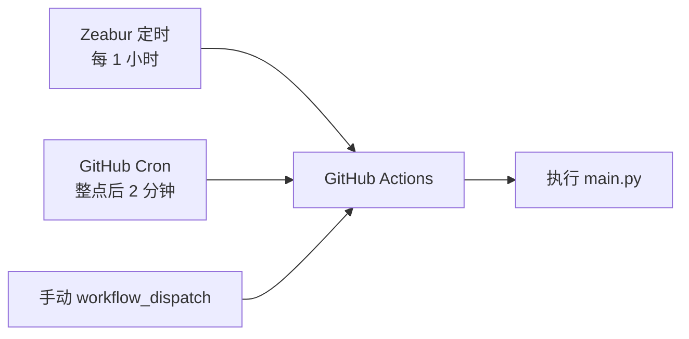
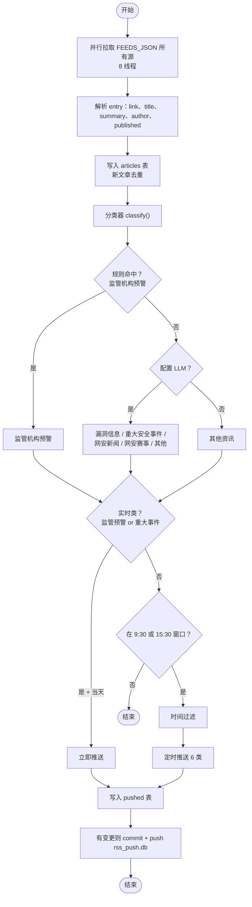
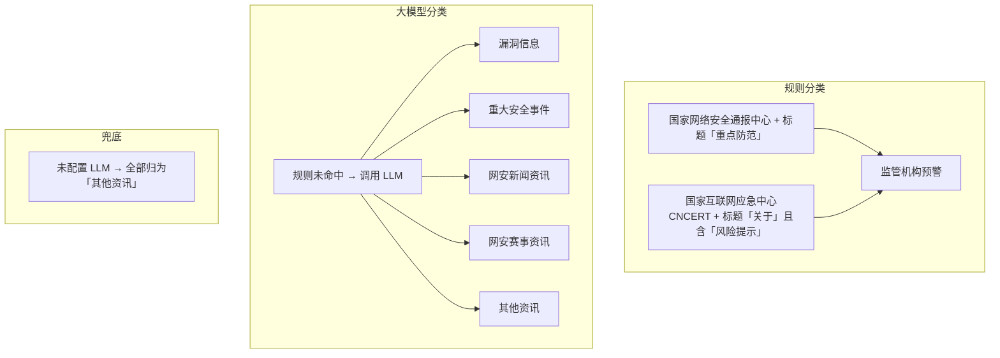
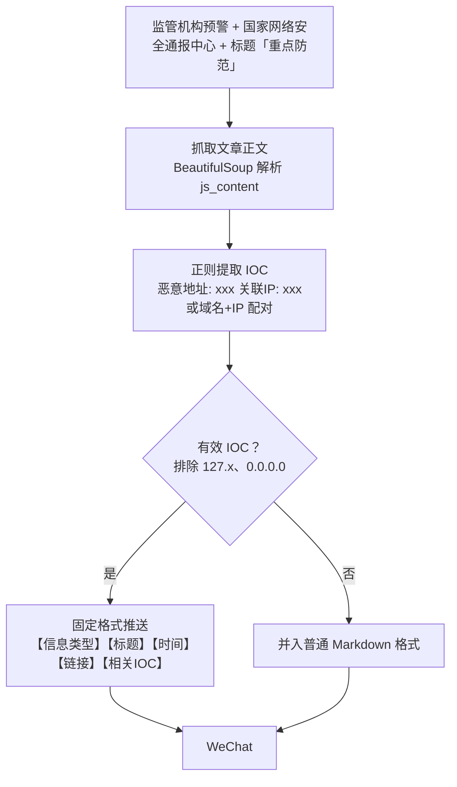
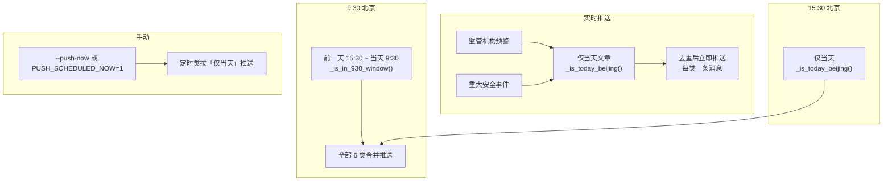
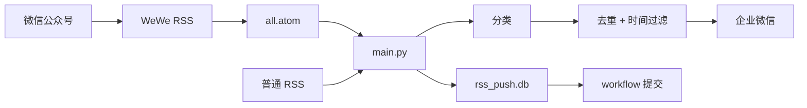

# RSS 推送到企业微信 - 完整部署流程图

---

## 如何查看流程图

当前文档使用 Mermaid 语法，若预览只显示代码、不显示图形，可用下面任一方式查看：

1. **GitHub**：把文件推送到仓库，在 GitHub 网页打开此 `.md` 文件，会自动渲染流程图  
2. **Mermaid Live**：打开 [mermaid.live](https://mermaid.live)，复制下方任意 `mermaid` 代码块粘贴进去即可看到图  
3. **Cursor / VS Code**：安装插件 [Markdown Preview Mermaid Support](https://marketplace.visualstudio.com/items?itemName=bierner.markdown-mermaid)，然后 `Cmd+Shift+V` 打开预览

---

## 一、数据源：从公众号到 RSS

**说明**：
- **WeWe RSS**：独立服务，部署在 Zeabur，将微信公众号转为 RSS。用户在其后台订阅公众号后，输出 `https://xxx.zeabur.app/feeds/all.atom`
- **FEEDS_JSON**：每项为 `[feed_url, source_type]`，`source_type` 为 `wewe_rss`（公众号）或 `rss`（普通 RSS）
- **WEWE_RSS_URL**：用于识别公众号来源，规则分类（如监管机构预警）依赖作者/公众号名

---

## 二、整体部署架构

---

## 三、触发链路

---

## 四、main.py 完整执行流程

---

## 五、需求模块详解

### 5.1 分类模块（6 类）

| 分类 | 说明 | 推送方式 |
|------|------|----------|
| 监管机构预警 | 规则命中 | 实时（仅当天） |
| 重大安全事件 | LLM 分类 | 实时（仅当天） |
| 漏洞信息 | LLM 分类 | 定时 9:30 / 15:30 |
| 网安新闻资讯 | LLM 分类 | 定时 |
| 网安赛事资讯 | LLM 分类 | 定时 |
| 其他资讯 | LLM 或兜底 | 定时 |

---

### 5.2 监管机构预警 - 重点防范（IOC 特殊格式）

---

### 5.3 推送策略模块

---

### 5.4 辅助模块

| 模块 | 说明 |
|------|------|
| **英文标题翻译** | 纯英文标题 → 调用 LLM 翻译 → 标题后加「（译）」 |
| **分片发送** | 单条超 3800 字节（约 4096 上限）→ 按换行分片，间隔 0.3s 防限流 |
| **去重** | `rss_push.db`：articles 表（已知链接）+ pushed 表（已推送），workflow 提交回仓库 |

---

## 六、数据流总览

---

## 七、组件与配置

| 组件 | 位置 | 说明 |
|------|------|------|
| **WeWe RSS** | Zeabur（独立项目） | 公众号 → RSS，输出 all.atom |
| **rss-push-trigger** | Zeabur（独立仓库） | 每 1 小时调用 repository_dispatch |
| **rss-push.yml** | eason727/.github/workflows/ | 拉取、运行 main.py、提交 DB |
| **main.py** | eason727/rss-wechat-pusher/ | 拉取、分类、推送、去重 |
| **classifier.py** | 同上 | 规则 + LLM 分类 |
| **rss_push.db** | 仓库内 | 持久化去重，workflow 自动提交 |

### 环境变量 / Secrets

| 变量 | 位置 | 必填 | 说明 |
|------|------|------|------|
| GITHUB_TOKEN | Zeabur | 是 | PAT，repo 权限 |
| WECHAT_WEBHOOK | GitHub Secrets | 是 | 企业微信机器人 Webhook |
| FEEDS_JSON | GitHub Secrets | 是 | `[["url","wewe_rss"],["url","rss"],...]` |
| WEWE_RSS_URL | GitHub Secrets | 否 | WeWe RSS 地址，用于识别公众号 |
| LLM_API_KEY | GitHub Secrets | 否 | 大模型 API Key（DeepSeek/通义/智谱等） |
| LLM_BASE_URL | GitHub Secrets | 否 | API 地址 |
| LLM_MODEL | GitHub Secrets | 否 | 模型名 |
